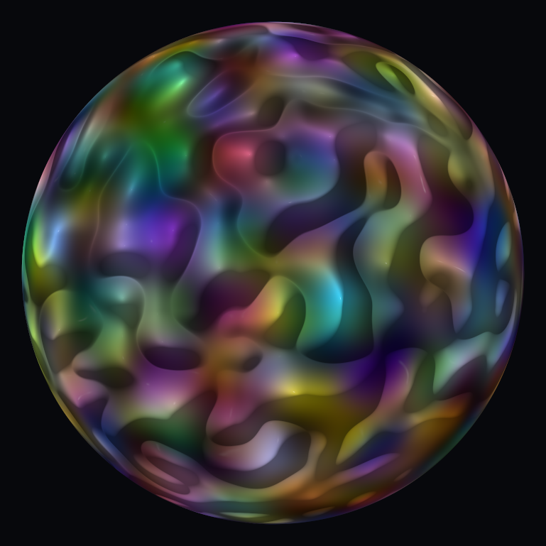
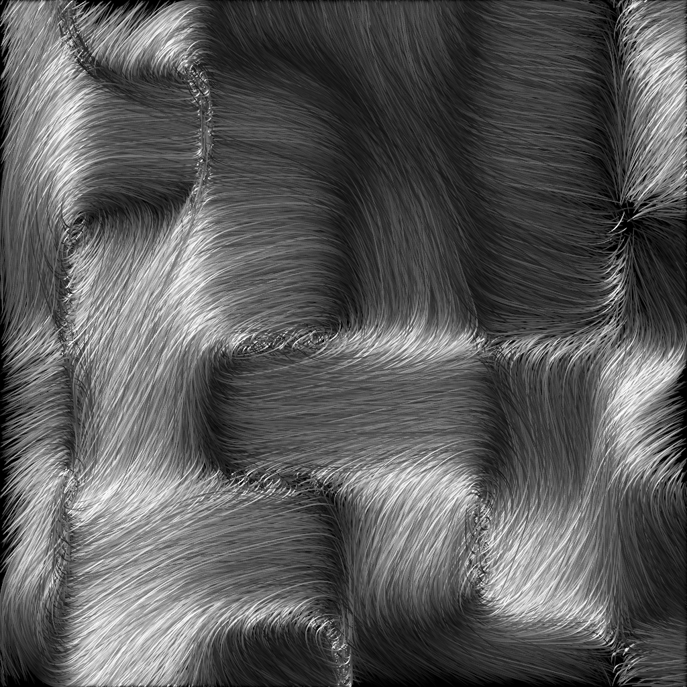
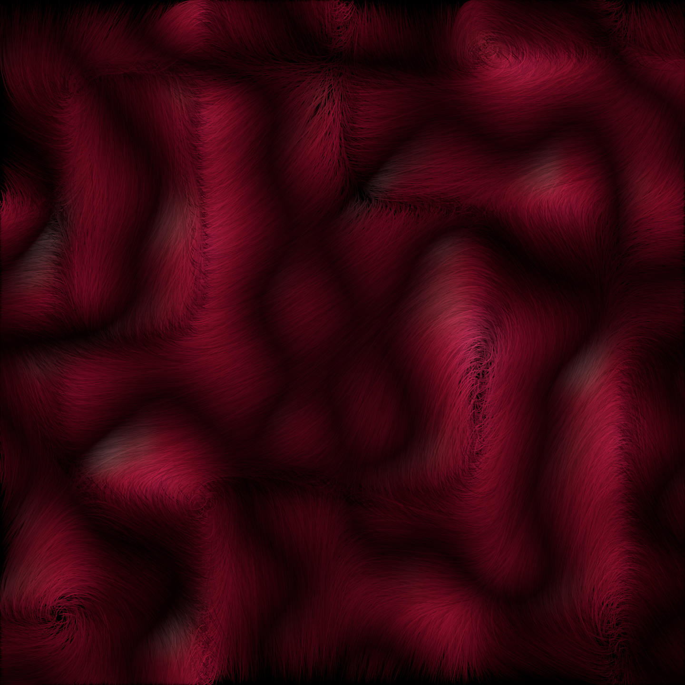

# Perlin Noise

Perlin noise in any number of dimensions, with a renderer that turns a field
into an image. No dependencies unless you ask for the GPU or PNG features.

<p align="center">
  
</p>

That image is a two dimensional field read as a height map and lit:
`just wallpaper-square` writes the same thing at 3841x3841.

## Rendering images

```sh
just                                          # list every recipe
just image relief --seed 7 --cells 12         # any mode plus flags -> images/relief.png
just wallpaper 1                              # 4K, 3841x2161
just wallpaper 1 --palette azure              # same picture in blue
just wallpaper-square 1                       # 4K square, 3841x3841
just globe 1                                  # a lit sphere, 1440x1440
just globe 3 --palette crimson                # the same sphere in red
just hair 1                                   # a coat of hair, 1440x1440
just hair-color 1                             # the same coat painted with the relief
just hair-wallpaper 1                         # the same coat at 4K
just gallery                                  # one image per mode, side by side
just options                                  # every flag with its default
just show images/relief.png                   # open it (macOS)
```

Images land in `images/`, which is not tracked. Modes are `gray`, `color`,
`channels`, `relief`, `globe` and `hair`; `just options` lists the flags, which
cover the lattice (`--cells`, `--detail`, `--seed`), the colour (`--palette`),
the lighting (`--shape`, `--height`, `--gamma`, `--occlusion`, `--light`,
`--ambient`, `--diffuse`, `--specular`, `--gloss`) and the coat `hair` grows
(`--count`, `--steps`, `--step`, `--force`, `--drag`, `--swirl`, `--frizz`,
`--thickness`, `--opacity`, `--jitter`, `--depth`, `--taper`, `--tint`).

## The noise field

`dims` counts *cells* per axis, so `[3, 1, 2]` is a 3x1x2 grid with
`4 * 2 * 3 = 24` intersections. Every intersection holds a random unit vector
of `dims.len()` components, drawn from the seed, so the same seed always
rebuilds the same field.

```rust
use perlin_noise::Instance;

let noise = Instance::new(vec![3, 1, 2], 42)?;

// One point, anywhere inside [0, 3] x [0, 1] x [0, 2].
let value = noise.noise(&[1.5, 0.25, 2.0])?;

// Or every intersection of a finer lattice: one divisor per axis says how
// many pieces each cell is cut into, so this is a 7 x 2 x 9 table.
let table = noise.table(&[2, 1, 4])?;
assert_eq!(table.shape(), &[7, 2, 9]);
```

Worth knowing:

- Sampling a point outside `[0, dims[i]]` is an error, as is a `NaN`
  coordinate or the wrong number of them. The upper bound is inclusive.
- Values are raw Perlin: centred on zero, bounded by `±sqrt(n)`, and exactly
  zero at every intersection of the original lattice. Nothing is rescaled to
  `[-1, 1]`.
- Tables are row-major with the last axis contiguous. `table_shape` reports the
  size before anything is computed.
- Each sample blends the `2^n` corners of its cell, so cost per point doubles
  per dimension. `MAX_DIMS` caps `dims.len()` at 16.
- Tables above 16k points are split across threads.

## Images from a field

A `Renderer` wraps a field of two to four dimensions. Axes map to the image the
way a row-major array does: the first axis runs down the image, the second
across it, and for a three dimensional field the third is the colour axis.

```rust
use perlin_noise::{Instance, Palette, Relief, Renderer};

// Two dimensions: greyscale, a colour ramp, or lit as a height map.
let flat = Renderer::new(Instance::new(vec![8, 8], 42)?)?;
flat.grayscale(&[64, 64])?.write_png("gray.png")?;
flat.colored(&[64, 64], Palette::Terrain)?.write_png("terrain.png")?;
flat.relief(&[64, 64], &Relief::default())?.write_png("relief.png")?;

// Three dimensions: the third axis feeds the colour.
let deep = Renderer::new(Instance::new(vec![8, 8, 1], 42)?)?;
deep.rgb_channels(&[64, 64, 8])?;                  // 3 slices -> R, G, B
deep.rgb_channels_at(&[64, 64, 8], [0, 1, 2])?;    // ...at slices you choose
deep.rgb_palette(&[64, 64, 1], 0, Palette::Heat)?; // one slice -> a ramp
```

Every image is scaled so its own darkest and brightest samples land at the ends
of the range. That keeps a single image well exposed but means two images are
not comparable; read `table` directly if you need absolute values.

How far apart the `rgb_channels` slices sit decides how much the channels share.
Neighbouring slices give colours that drift, distant ones give vivid unrelated
channels, and the default spreads them over the whole axis. One cell is usually
enough depth.

## Relief

`relief` reads the field as a height map, takes the surface normal from the
slope between neighbouring samples, and lights it. `Relief::default()` is the
glossy liquid look in the image above; every field is public.

- `shape` turns noise into height. `Billow` uses the distance from zero, so the
  lines where the noise changes sign become creases between rounded blobs.
  `Ridged` inverts that into raised veins, `Smooth` leaves rolling hills.
- `gamma` curves the height map that both the shading and the palette read.
  Above 1.0 it opens the creases into wider, gentler basins, which is the main
  dial for how gradual the fall into the dark is.
- `occlusion` darkens the low ground for sitting in its own shadow. This is
  what makes creases dark, and because it follows the height smoothly the
  falloff stays a gradient.
- `light`, `ambient`, `diffuse`, `specular` and `gloss` are the lighting;
  `height` is how far the height map is exaggerated before slopes are measured.

Shading happens in linear light and is re-encoded to sRGB at the end, and the
highlight is gated by the diffuse term so surfaces turned away from the light
do not catch a reflection of it.

`Crimson` and `Azure` are the palettes meant for relief: they hold no black at
all, so the dark comes only from the shading. The others (`Gray`, `Heat`,
`Terrain`, `BlueRed`) bottom out in black, which draws a hard edge wherever the
surface dips. New ramps are eight or so evenly spaced stops in
`Palette::stops`.

## A sphere out of four dimensions

<p align="center">
  
</p>

`globe` spends three of the four axes on the sphere itself and reads the fourth
for what the surface looks like.

```rust
use perlin_noise::{Globe, Instance, Renderer};

// Seven cells across the sphere, two along the axis its surface is read off.
let round = Renderer::new(Instance::new(vec![7, 7, 7, 2], 42)?)?;
round.globe(1440, 1440, &Globe::default())?.write_png("globe.png")?;
```

The unit sphere is inscribed in the lattice box, so a point's direction from
the centre *is* its position in the field. Nothing is wrapped around anything,
which is why there is no seam and no stretching at the poles.

The fourth axis is then sampled at four evenly spaced depths. The first is the
point's distance from the centre, and the other three are its red, green and
blue. How deep that axis is decides how much the four share: one cell keeps
them a fraction of a cell apart, so colour and height stay related and the
sphere comes out pearly, while two or three spread them past a cell each and
the colours turn vivid and unrelated. Setting `rgb_from_fourth_axis` to false
colours the sphere by height through `surface.palette` instead, which is what
`--palette` does on the command line.

`surface` is a `Relief`, so the lighting and shaping are the same knobs as
above, with `height` read as how far the surface rises as a fraction of the
radius. Past about 1.0 it stops buying much, because taller bumps also swell
the sphere they sit on, so the shape grows with itself and the slopes settle.
`fill` is how much of the shorter side of the image the sphere takes, and
`background` is the colour behind it, which the rim fades into over the last
half pixel.

Its defaults are lit rather differently from the flat relief, because a sphere
tall enough to read at a glance has much steeper walls than a height map does:

- `gamma` is higher, which opens the creases between blobs into basins the
  surface can fall through gradually. Left narrow they close to a hard line.
- `occlusion` is deeper, so the hollows arrive somewhere near black instead of
  stopping at a grey.
- `gloss` is far tighter. A wide highlight on a steep wall lights the whole
  wall at once, and a white smear over a dark hollow is what gives it a grey
  cast. The highlight is also dimmed by the occlusion twice over: a hollow
  deep enough to sit in its own shadow has no clear line to the light to
  reflect either.
- `samples` shades each pixel more than once and averages the result in linear
  light. One sample leaves the highlights speckled wherever the surface is
  steeper than a pixel, which is most of it.

Height tilts the surface and shades it but does not move the outline, which
stays a circle. Unlike the other modes this one follows a surface rather than a
lattice, so it takes a size in pixels, `divisors` play no part, and there is no
GPU path; `dims` alone set the feature size, in cells across the diameter.

## Hair out of a field read as a force

<p align="center">
  
  
</p>

Every other mode reads the lattice as a picture. `hair` reads it as a force:
particles are dropped into the field at seeded random points, the vectors
around each one push it about, and the path it takes is drawn as one strand of
a coat that lies over itself.

```rust
use perlin_noise::{Hair, Instance, Renderer};

// Wide cells, so a strand has room to run before the field turns it.
let combed = Renderer::new(Instance::new(vec![5, 5], 42)?)?;
combed.hair(1024, 1024, &Hair::default())?.write_png("hair.png")?;
```

The force is the same blend the noise is. Every corner of the cell a particle
sits in pulls on it under the same fade weights, except that it is the
gradients themselves being blended rather than their dot products with the
offset. `Instance::force` is that vector on its own; being an average of unit
vectors it is never longer than one.

### Where the particles go

Each particle obeys `dv/dt = force - drag * v`, so it carries momentum and a
strand does not turn as sharply as the field under it does, which is what keeps
the hair smooth rather than kinked. Three knobs decide where they end up:

- `drag` is how fast a particle loses the speed it has. High values pin it to
  the field's own direction and give a short, orderly coat; low ones leave
  enough momentum to overshoot and circle, drawing long sweeps that read more
  like smoke than fur. `force` over `drag` is roughly the speed a particle
  settles at, and that times `steps` times `step` is about how far a strand
  travels, in cells.
- `swirl` turns the force before it is applied. At 0 the particles run straight
  into whatever the lattice points at and collect there; near 90 they orbit it
  instead, which fills the picture evenly. The default sits between the two.
- `frizz` pushes each particle a way of its own, held for the whole of its
  length. Without it two particles that start together follow the very same
  path, so the strands lie perfectly parallel and the coat comes out combed
  flat; a little of it sets them across each other the way real hair lies. Past
  about 0.3 the field can no longer hold them and the coat turns to fluff.

`step` only decides how finely a path is traced, never what the path is: the
drag is integrated exactly rather than by an Euler step, so raising it cannot
make anything blow up.

### Why it reads as hair

The strands are drawn as a coat rather than added together, which is the whole
difference between this and a smooth picture of the same flow. Each one gets a
depth, they go down back to front, and each is `opacity` opaque, so a strand
hides what it crosses instead of brightening it.

- `depth` is how much darker a strand right at the back is than one at the
  front. The dark between the lit hairs is the hair buried under them, and that
  is where the coat gets its volume from.
- `jitter` is how unlike each other the strands are: how much of its brightness,
  thickness and length any one of them may be short of. One dull hair among
  bright ones is what lets the eye pick a single strand out, so at 0 they merge
  into a wash and the picture stops looking like hair at all.
- `thickness` is how wide a strand is drawn, in pixels, and `taper` the fraction
  at each end it narrows to a point over. Below a pixel wide it goes on thinning
  by turning see-through, since there is no width left to take away.

How dense a coat looks is `count` against the pixel count, so a bigger picture
wants proportionally more particles; the `just` recipes scale theirs with their
size.

A strand is lit by how squarely it lies across `light` rather than by which way
it faces, the way a fibre is: one running along the light goes dark, one
crossing it lights up, and a curving strand passes through both. `ambient` and
`diffuse` are the two ends of that, and `specular` with `gloss` is the sheen,
the narrow band of light that runs over hair where it turns square to the
light. It is worth leaving the sheen to carry the brightness rather than the
diffuse term: with a broad highlight every strand facing the same way flares at
once, and the coat goes back to reading as a lit surface. `palette` runs from
the background at the bottom to a strand in full sheen at the top, so `Gray` is
white hair on black and `Crimson` a red fur.

`color_from_field` paints that same coat with [`Renderer::relief`] of the field
the particles are running in. The strands stay hair; the colour under them is
the glossy height map, so `just hair-color` is the crimson liquid look with
fur on it. `surface` is the `Relief` that map is drawn with, and `--palette`,
`--shape`, `--height`, `--gamma` and `--occlusion` belong to it.

Like the globe this follows paths rather than sample points, so it takes a size
in pixels, `divisors` play no part and there is no GPU path. The lattice box is
stretched over the image, so `dims` wants the image's aspect ratio if the
strands are not to be stretched with it, and a particle that walks out of the
box ends its strand there.

## Features

Neither is on by default, so a plain build pulls in nothing.

| Feature | Adds |
| --- | --- |
| `gpu` | `Instance::table_gpu` and `Renderer::with_gpu`, via a `wgpu` compute shader |
| `png` | `Image::write_png` |

The shader computes in 32 bit floats where the CPU uses 64, so GPU values
differ by about `1e-6` — far below what a pixel keeps, but visible if you
compare tables. It reports an error rather than panicking when no adapter is
available, so falling back to `table` is always an option.

## Development

```sh
just check      # fmt, clippy over every feature combination, then tests
just test-all   # adds the slow multi-dispatch GPU test
```
