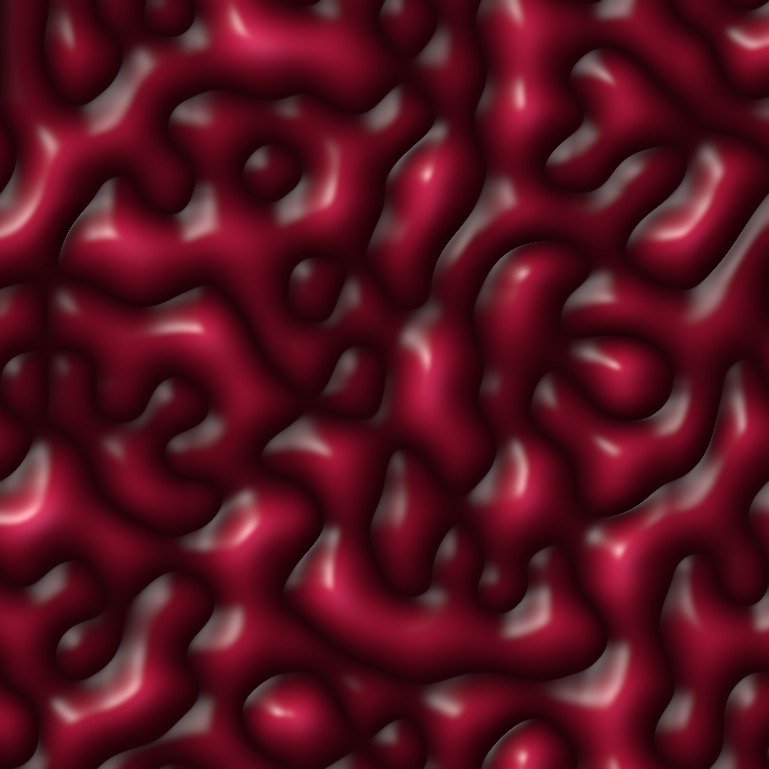

# Perlin Noise

Perlin noise in any number of dimensions, with a renderer that turns a field
into an image. No dependencies unless you ask for the GPU or PNG features.

<p align="center">
  
</p>

That image is a two dimensional field read as a height map and lit:
`just wallpaper-square` writes the same thing at 3841x3841.

## Rendering images

```sh
just                                          # list every recipe
just image relief --seed 7 --cells 12         # any mode plus flags -> images/relief.png
just wallpaper 1                              # 4K, 3841x2161
just wallpaper 1 --palette azure              # same picture in blue
just wallpaper-square 1                       # 4K square, 3841x3841
just gallery                                  # one image per mode, side by side
just options                                  # every flag with its default
just show images/relief.png                   # open it (macOS)
```

Images land in `images/`, which is not tracked. Modes are `gray`, `color`,
`channels` and `relief`; `just options` lists the flags, which cover the
lattice (`--cells`, `--detail`, `--seed`), the colour (`--palette`) and the
lighting (`--shape`, `--height`, `--gamma`, `--occlusion`, `--light`,
`--ambient`, `--diffuse`, `--specular`, `--gloss`).

## The noise field

`dims` counts *cells* per axis, so `[3, 1, 2]` is a 3x1x2 grid with
`4 * 2 * 3 = 24` intersections. Every intersection holds a random unit vector
of `dims.len()` components, drawn from the seed, so the same seed always
rebuilds the same field.

```rust
use perlin_noise::Instance;

let noise = Instance::new(vec![3, 1, 2], 42)?;

// One point, anywhere inside [0, 3] x [0, 1] x [0, 2].
let value = noise.noise(&[1.5, 0.25, 2.0])?;

// Or every intersection of a finer lattice: one divisor per axis says how
// many pieces each cell is cut into, so this is a 7 x 2 x 9 table.
let table = noise.table(&[2, 1, 4])?;
assert_eq!(table.shape(), &[7, 2, 9]);
```

Worth knowing:

- Sampling a point outside `[0, dims[i]]` is an error, as is a `NaN`
  coordinate or the wrong number of them. The upper bound is inclusive.
- Values are raw Perlin: centred on zero, bounded by `±sqrt(n)`, and exactly
  zero at every intersection of the original lattice. Nothing is rescaled to
  `[-1, 1]`.
- Tables are row-major with the last axis contiguous. `table_shape` reports the
  size before anything is computed.
- Each sample blends the `2^n` corners of its cell, so cost per point doubles
  per dimension. `MAX_DIMS` caps `dims.len()` at 16.
- Tables above 16k points are split across threads.

## Images from a field

A `Renderer` wraps a two or three dimensional field. Axes map to the image the
way a row-major array does: the first axis runs down the image, the second
across it, and for a three dimensional field the third is the colour axis.

```rust
use perlin_noise::{Instance, Palette, Relief, Renderer};

// Two dimensions: greyscale, a colour ramp, or lit as a height map.
let flat = Renderer::new(Instance::new(vec![8, 8], 42)?)?;
flat.grayscale(&[64, 64])?.write_png("gray.png")?;
flat.colored(&[64, 64], Palette::Terrain)?.write_png("terrain.png")?;
flat.relief(&[64, 64], &Relief::default())?.write_png("relief.png")?;

// Three dimensions: the third axis feeds the colour.
let deep = Renderer::new(Instance::new(vec![8, 8, 1], 42)?)?;
deep.rgb_channels(&[64, 64, 8])?;                  // 3 slices -> R, G, B
deep.rgb_channels_at(&[64, 64, 8], [0, 1, 2])?;    // ...at slices you choose
deep.rgb_palette(&[64, 64, 1], 0, Palette::Heat)?; // one slice -> a ramp
```

Every image is scaled so its own darkest and brightest samples land at the ends
of the range. That keeps a single image well exposed but means two images are
not comparable; read `table` directly if you need absolute values.

How far apart the `rgb_channels` slices sit decides how much the channels share.
Neighbouring slices give colours that drift, distant ones give vivid unrelated
channels, and the default spreads them over the whole axis. One cell is usually
enough depth.

## Relief

`relief` reads the field as a height map, takes the surface normal from the
slope between neighbouring samples, and lights it. `Relief::default()` is the
glossy liquid look in the image above; every field is public.

- `shape` turns noise into height. `Billow` uses the distance from zero, so the
  lines where the noise changes sign become creases between rounded blobs.
  `Ridged` inverts that into raised veins, `Smooth` leaves rolling hills.
- `gamma` curves the height map that both the shading and the palette read.
  Above 1.0 it opens the creases into wider, gentler basins, which is the main
  dial for how gradual the fall into the dark is.
- `occlusion` darkens the low ground for sitting in its own shadow. This is
  what makes creases dark, and because it follows the height smoothly the
  falloff stays a gradient.
- `light`, `ambient`, `diffuse`, `specular` and `gloss` are the lighting;
  `height` is how far the height map is exaggerated before slopes are measured.

Shading happens in linear light and is re-encoded to sRGB at the end, and the
highlight is gated by the diffuse term so surfaces turned away from the light
do not catch a reflection of it.

`Crimson` and `Azure` are the palettes meant for relief: they hold no black at
all, so the dark comes only from the shading. The others (`Gray`, `Heat`,
`Terrain`, `BlueRed`) bottom out in black, which draws a hard edge wherever the
surface dips. New ramps are eight or so evenly spaced stops in
`Palette::stops`.

## Features

Neither is on by default, so a plain build pulls in nothing.

| Feature | Adds |
| --- | --- |
| `gpu` | `Instance::table_gpu` and `Renderer::with_gpu`, via a `wgpu` compute shader |
| `png` | `Image::write_png` |

The shader computes in 32 bit floats where the CPU uses 64, so GPU values
differ by about `1e-6` — far below what a pixel keeps, but visible if you
compare tables. It reports an error rather than panicking when no adapter is
available, so falling back to `table` is always an option.

## Development

```sh
just check      # fmt, clippy over every feature combination, then tests
just test-all   # adds the slow multi-dispatch GPU test
```
